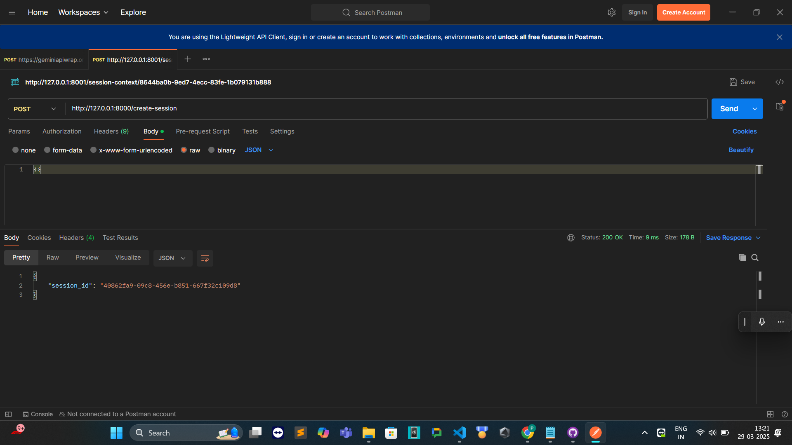
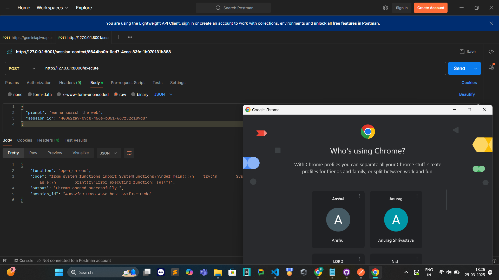
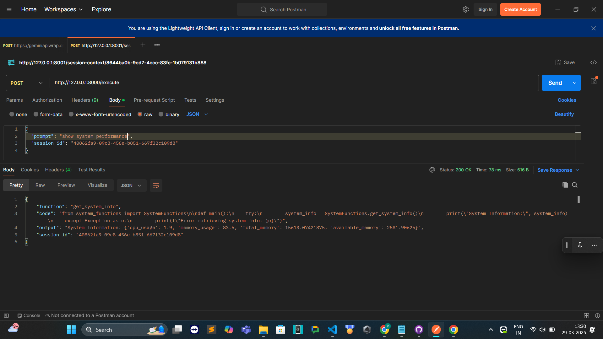
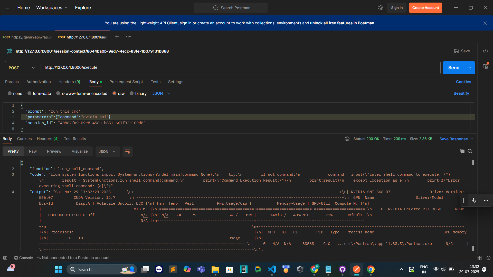
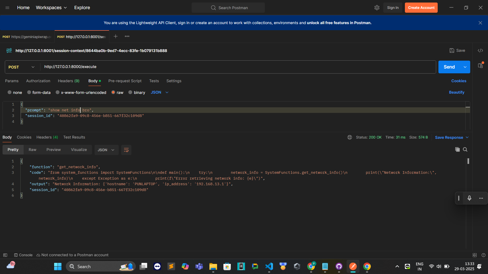
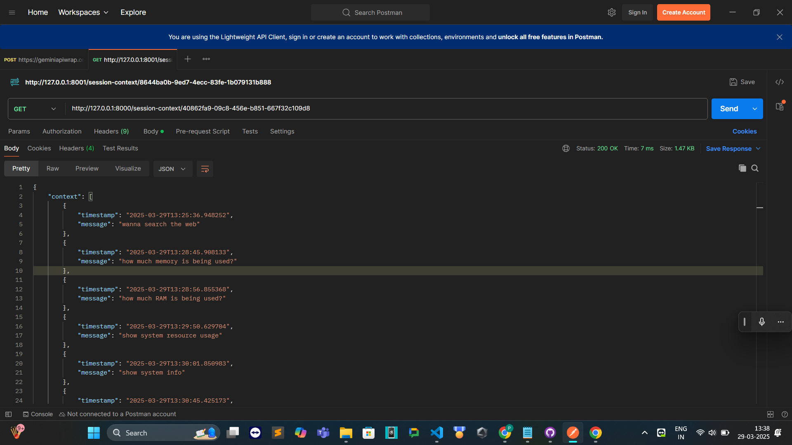
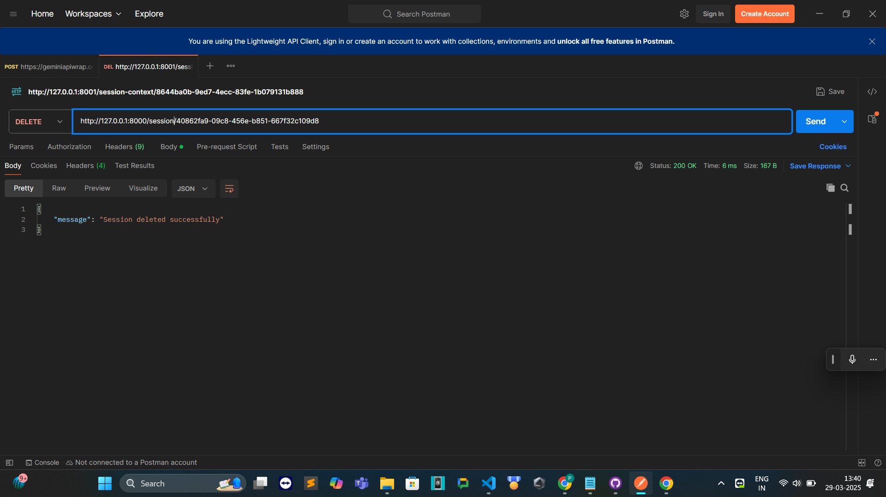

# LLM RAG Function Executor with Session Management

## Overview
This project is a **Function Execution API** powered by **LLMs (Large Language Models)** and **session management**. It takes a **prompt**, figures out which function to run, generates the code dynamically, executes it, and returns the output. It can also execute **shell commands** and **launch applications**.

It supports:
- **Session Management** (track previous prompts and executions)
- **Dynamic Function Execution** (run generated code securely)
- **Executing Shell Commands** (run terminal commands via API)
- **Opening Applications** (launch apps from a prompt)

---

## Installation & Setup
### Prerequisites
- Python 3.9+
- FastAPI
- Uvicorn
- Required dependencies from `requirements.txt`

### Steps
1. Clone the repository:
   ```sh
   git clone https://github.com/your-repo/llm-function-executor.git
   cd llm-function-executor
   ```
2. Install dependencies:
   ```sh
   pip install -r requirements.txt
   ```
3. Run the FastAPI server:
   ```sh
   uvicorn main:app --reload
   ```
4. The API will be available at `http://127.0.0.1:8000/`

---

## How to Use
### 1. Create a Session
A session helps track previous interactions.
```sh
curl -X POST "http://127.0.0.1:8000/create-session"
```
#### Response:
```json
{
  "session_id": "abc123"
}
```

### 2. Execute a Function with a Prompt
Send a prompt to execute a function dynamically.
```sh
curl -X POST "http://127.0.0.1:8000/execute" \
     -H "Content-Type: application/json" \
     -d '{"prompt": "run_shell_command", "parameters": {"command": "ls"}}'
```
#### Response:
```json
{
  "function": "run_shell_command",
  "code": "<generated code>",
  "output": "file1.txt\nfile2.txt",
  "session_id": "abc123"
}
```

### 3. Get Session Context
Retrieve the session’s previous interactions.
```sh
curl -X GET "http://127.0.0.1:8000/session-context/abc123"
```
#### Response:
```json
{
  "context": ["run_shell_command"],
  "function_history": ["run_shell_command"]
}
```

### 4. Delete a Session
```sh
curl -X DELETE "http://127.0.0.1:8000/session/abc123"
```
#### Response:
```json
{
  "message": "Session deleted successfully"
}
```

---

## Endpoints Summary
| Method | Endpoint | Description |
|--------|----------|-------------|
| `POST` | `/create-session` | Create a new session |
| `POST` | `/execute` | Execute a function with a prompt |
| `GET` | `/session-context/{session_id}` | Get session history |
| `DELETE` | `/session/{session_id}` | Delete a session |

---

## Screenshots

### 1. Session creation and execution 
<div align="center">
  
  
</div>

### 2. Examples of execution of some commands 
<div align="center">
  
  
</div>

### 3. Application Launch & Session Context  
<div align="center">
  
  
</div>

### 4. Session deletion 
<div align="center">
  
</div>
